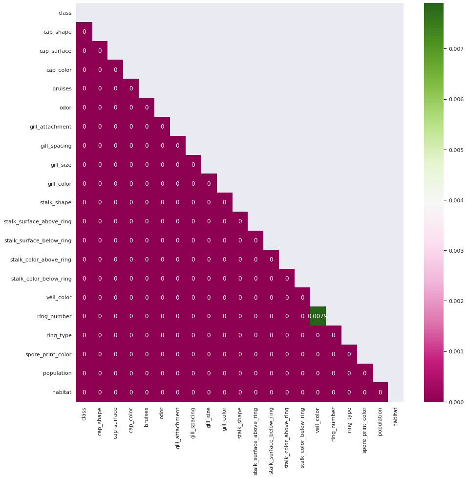
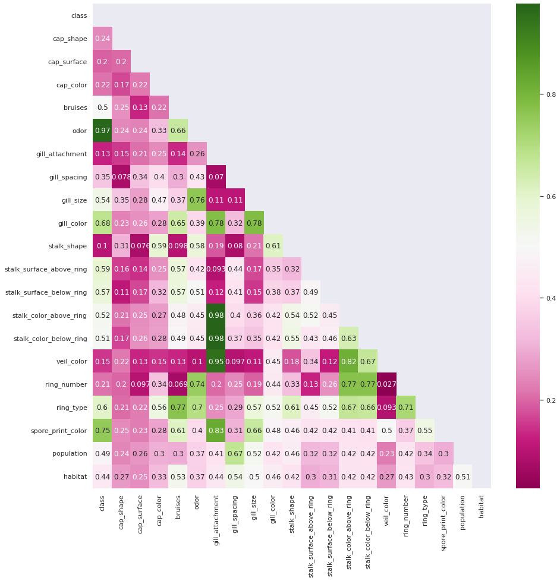
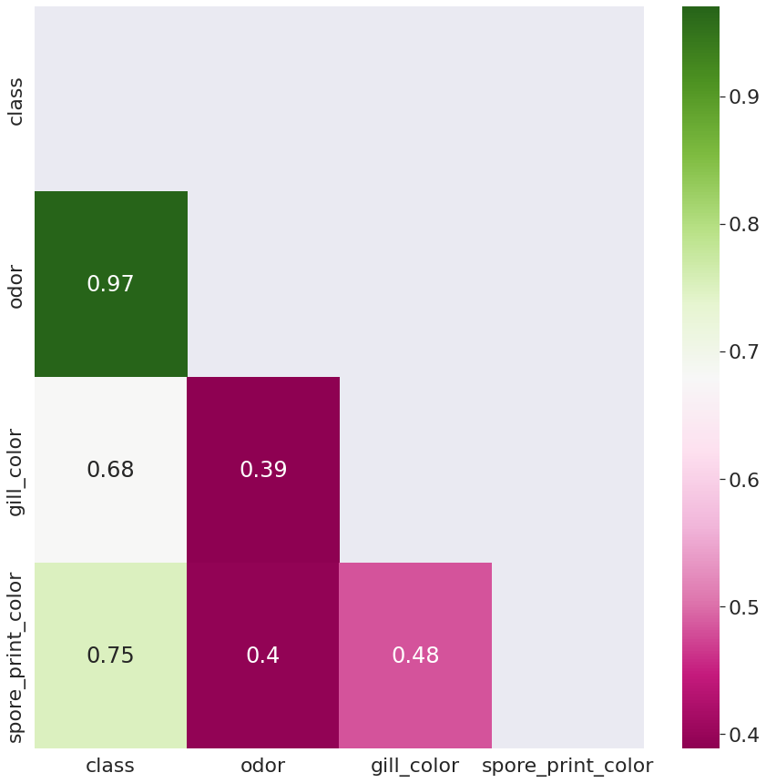
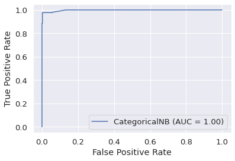
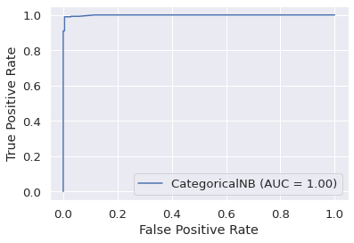

# Mushroom Classification
This project was conducted in semester 1 2021 as part of a university unit.

The aim of this project was to perform classification of mushrooms as edible or poisonous using the "Mushroom Data Set" submitted to the UCI Machine Learning Repository. The dataset was modified by the unit to prevent plagiarism.

# Contents

- [Mushroom Classification](#mushroom-classification)
- [Contents](#contents)
- [Data cleaning](#data-cleaning)
  - [Missing possible values](#missing-possible-values)
  - [Missing Values](#missing-values)
  - [Data Types](#data-types)
  - [Associated Values](#associated-values)
  - [Splitting the data](#splitting-the-data)
  - [Encoding the data](#encoding-the-data)
- [Classifying the data](#classifying-the-data)
  - [Model selection](#model-selection)
  - [Results](#results)
  - [Interpreting Results](#interpreting-results)
- [References](#references)

# Data cleaning

## Missing possible values

The first step in the data cleaning process was ensuring the data complied with the data dictionary. To this extent I checked every value for every attribute to determine if values given in the dictionary did not appear in the data and if values in the data were not included in the dictionary:

| Attribute        | Missing values                         |
|------------------|----------------------------------------|
| gill_attachment  | Descending – d, Notched - n            |
| gill_spacing     | Distant – d                            |
| stalk_root       | Cup – u, Rhizomorphs – z               |
| veil_type        | Universal – u                          |
| ring_type        | Cobwebby – c, Sheathing – s, Zone – z  |

Of these values veil\_type is most significant as it has two possible values, u and p. Because u is not present in the dataset, veil\_type only has a single value and hence should be excluded.

gill\_attachement, gill\_spacing, stalk\_root, and ring\_type all have values that are not present within the dataset. No conclusions can be drawn about these values, so these attributes are assumed to only have the possible values that appear within the dataset.

## Missing Values

stalk\_root includes a value, missing – ?, which occurs 2480 times or in 31% of values.

To attempt to recover this data I removed all rows with missing data and ran bias adjusted Cramer&#39;s V to determine how closely associated stalk\_root was to other attributes. The closest association was odor at 0.62 with 18 degrees of freedom which indicates a moderate to strong link and presents the possibility of filling in stalk\_root data using odor. The Pearson&#39;s chi-squared test has a probability of less than of being independent and this is obvious when looking at the frequency table:

| stalk_root  | odor  |     |      |     |    |      |     |
|-------------|-------|-----|------|-----|----|------|-----|
|             | a     | c   | f    | l   | m  | n    | p   |
| b           | 48    | 192 | 1584 | 48  | 0  | 1904 | 0   |
| c           | 256   | 0   | 0    | 256 | 36 | 8    | 0   |
| e           | 0     | 0   | 0    | 0   | 0  | 864  | 256 |
| r           | 96    | 0   | 0    | 96  | 0  | 0    | 0   |

However, one assumption in a naïve bayes classifier is that the input attributes are independent and using one attributes to rectify data in another attribute violates this assumption. Considering this, and the large number of attributes, I chose to remove the stalk\_root attributes from the dataset.

## Data Types

Most attributes in the dataset are categorical. Attributes, such as bruises, are either true or false but this is still best considered as categorical data. The attribute, ring\_number, unlike all other attributes is representing the numerical values, 0, 1, and 2. For this assignment I chose maintain this attribute as a categorical variable as I did not want to introduce additional complexity by introducing a single numerical attribute.

## Associated Values

<style>
    .imgPara {
  display: flex;
  justify-content: center;
  align-items: flex-start;
}
</style>

<div class="imgPara">
<p>Naïve bayes classifiers have a strong assumption that all attributes are independent, hence highly associated attributes may reduce prediction accuracy. However, removing attributes that are not perfectly correlated may result in a loss of information. A balance must be struck between removing closely correlated attributes and not reducing input information substantially. To identify the most closely associated variables I initially produced a heatmap of the Pearson Chi Squares p values.</p>

</div>
<br>
<div class="imgPara">
<p>Unfortunately, all attributes in the dataset are not independent with a p value of < 0.0005 except for ring_number and veil_color at p=0.008. To determine which attributes are worth removing we must look at the strength of association. The chi value can be used however it is difficult to interpret as it will return a higher value for larger input sizes. Hence Cramer's V [4] will be used as it returns a value between 0 and 1. This value is not linear and while a value close to 1 indicates a very strong association, a value 0.5 still indicates moderate to strong association.</p>

</div>
<br>
Odor is highly correlated with class and gill_attachments is highly associated with 3 attributes. To confirm that this result is accurate I produced the frequency table for odor and class.

| class | odor  |     |      |     |    |      |     |     |     |
|-------|-------|-----|------|-----|----|------|-----|-----|-----|
|       | a     | c   | f    | l   | m  | n    | p   | s   | y   |
| e     | 400   | 0   | 0    | 400 | 0  | 3408 | 0   | 0   | 0   |
| p     | 0     | 192 | 2160 | 0   | 36 | 120  | 256 | 576 | 576 |

Due to the strength of association between odor and class, a model that simply predicts class based solely on odor is 98.56% accurate. This however is uninteresting to investigate or build so more attributes will be used in model building.

<br>
<div class="imgPara">
<p>As many of the elements are moderately to strongly associated with the class attribute, only a few strongly associated and ideally independent attributes are required to train a strong model. <br> <br>
Hence, after some experimentation with training models with different quantities of variables, I selected odor, spore print color, and grill color as my attributes.</p>

</div>
<br>


## Splitting the data

The assignment calls for the dataset to be split into three equal section which is accomplished using pandas sample() method.

```
  d1 = dataset.sample(frac = 0.3333333, random_state=seed)
  d2 = dataset.drop(d1.index).sample(frac = 0.5, random_state=seed)
  d3 = dataset.drop(d1.index).drop(d2.index).sample(frac = 1, random_state=seed)
```

Each subset of the data contains 2708 rows. More complex methods for splitting the data may be used, such as using stratified sampling, however, due to the large size of the dataset I decided this was not necessary.

To split the data into training and test sets I use scikit-learn&#39;s train\_test\_split function with a 7:3 training test split. This method also ensures the data is shuffled.
```
  test_data, training_data = train_test_split(Data, shuffle = True, random_state = seed, test_size=0.7)
  test_answers, training_answers = train_test_split(Answers, shuffle = True, random_state = seed, test_size=0.7)
```

Each test set has 812 rows, and each training set has 1896 rows.

## Encoding the data

The categorical naïve bayes classifier from scikit-learn expects all data encoded either via one hot encoding or label encoding so all data is encoded using label encoding.
```
if oneHot:
    formattedData = pd.get_dummies(Data, columns=st, prefix=st)
  else:
    formattedData = pd.DataFrame({col: Data[col].astype('category').cat.codes for col in Data}, index=Data.index)
```

One hot encoding was implemented however it returned worse results on average when compared to label encoding. This is likely due to the very large number of categories in one hot encoding not being a good fit for a naïve bayes classifier.

# Classifying the data

## Model selection

I chose to use a naïve bayes classifier as it was covered in week 8 and is ideal for classifying categorical data. The model was implemented through scikit-learn an open-source library for python. Other approaches I could have used include decision tree classifiers, or support vector machines.

## Results

| Run | Accuracy | TPR | FPR | FNR | Precision |
| --- | --- | --- | --- | --- | --- |
| 0 | 96.31 | 0.93 | 0.00 | 0.07 | 1.00 |
| 1 | 98.40 | 0.97 | 0.00 | 0.03 | 0.99 |
| 2 | 99.14 | 0.98 | 0.00 | 0.02 | 1.00 |

| Run 1: | Predicted Edible | Predicted Poison |
| --- | --- | --- |
| Edible | 419 | 1 |
| Poison | 29 | 363 |

| Run 2: | Predicted Edible | Predicted Poison |
| --- | --- | --- |
| Edible | 422 | 2 |
| Poison | 11 | 377 |

| Run 3: | Predicted Edible | Predicted Poison |
| --- | --- | --- |
| Edible | 414 | 0 |
| Poison | 7 | 391 |

## Interpreting Results
<div class="imgPara">


 
</div>
<br>
Due to the size of the data and the strength of correlation between the class attribute and the other attributes the results from the training process are excellent. The ROC curves are near perfect and AUC values are \&gt; 0.99 indicating the model is well trained.

The most critical value is the false negative rate and no model successfully predicted 0 false negatives. This indicates that these models are not suitable for practical use as they have a non-zero chance of classifying a poisonous mushroom as edible.

[To see workings, see colab document.](https://colab.research.google.com/drive/1pUuYXOZfxoNpYETXJWwD1_OPwj1g0IJF?usp=sharing)

# References

1. Kaggle.com. 2021. _Analysis and Classification of mushrooms_. [online] Available at: \&lt;https://www.kaggle.com/haimfeld87/analysis-and-classification-of-mushrooms\&gt; [Accessed 6 May 2021].
2. Medium. 2021. _Mushroom Classification Using Different Classifiers_. [online] Available at: \&lt;https://medium.com/analytics-vidhya/mushroom-classification-using-different-classifiers-aa338c1cd0ff\&gt; [Accessed 6 May 2021].
3. Medium. 2021. _The Search for Categorical Correlation_. [online] Available at: \&lt;https://towardsdatascience.com/the-search-for-categorical-correlation-a1cf7f1888c9\&gt; [Accessed 6 May 2021].
4. Eunicien, Z., 2021. _Using pandas, calculate Cramér&#39;s coefficient matrix - Answer_. [online] Stack Overflow. Available at: \&lt;https://stackoverflow.com/a/39266194\&gt; [Accessed 6 May 2021].
